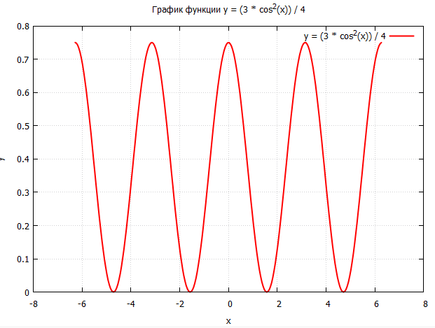

# Assembly_Course

## lab1

1) ввод с клавиатуры числа в заданной системе счисления (система счисления А);
2) вывод введенного числа в десятичной системе счисления;
3) вычисление значения полинома вида ax2 + bx + c (в предположении, что результат вычислений не приводит к переполнению регистров);
4) вывод результата в заданной системе счисления (система счисления Б);
5) вывод результата в десятичной системе счисления.

СИ А = 2; СИ Б = 2; a = -1; b = 8; c = 10

## lab2

Написать программу, выделяющую из исходной строки подстроку заданной длины с указанного номера позиции и приводящую символы этой подстроки к нижнему регистру.

## lab3

Продолжить прошлую лабу, для передачи данных процедуре на языке Ассемблера использовать аргументы функции. Для вызова процедуры использовать следующие соглашения о вызовах: cdecl

## lab4

Написать программу, реализующую вычисление функции в точке (вводится пользователем), используя SWR, CWR, TWR...

Для отрисовки графика используется GNUPLot из файла plot.cpp

## How compile this in VS:

В папке template лежит готовое окружение для работы в VS 2022; закинуть нужные asm (и Си) файлы в папку ASM-lab1 и прикрепить к проекту. 

Запуск в режиме x86 - debug, это важно.

Для русификации поменять любыми подручными средствами кодировку с UTF-8 на Windows-1251.

## **Achtung**!

Пока не факт, что работает, я запутался с кодировками :<
